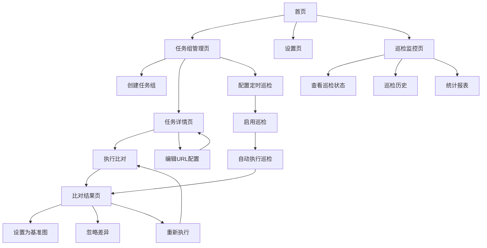

# 快照比对平台产品需求文档

## 1. 产品概述

快照比对平台是一个免费开放的网页视觉回归测试工具，通过截图比对技术帮助开发团队快速发现页面视觉变化。
- 解决网页UI变更检测难题，提供自动化的视觉回归测试能力，适用于前端开发团队、QA团队和产品团队。
- 目标是提供简单易用的在线工具，无需注册登录即可使用，降低使用门槛。

## 2. 核心功能

### 2.1 功能模块

我们的快照比对平台包含以下主要页面：
1. **首页**：平台介绍、快速开始引导、功能说明
2. **任务组管理页**：任务组列表、创建/编辑任务组、批量操作、定时巡检配置
3. **任务详情页**：单个任务组的URL列表、执行历史、结果查看、巡检状态监控
4. **比对结果页**：截图对比展示、差异高亮、操作按钮
5. **巡检监控页**：定时巡检状态总览、执行历史、统计报表
6. **设置页**：全局配置、截图参数设置、通知设置

### 2.2 页面详情

| 页面名称 | 模块名称 | 功能描述 |
|----------|----------|----------|
| 首页 | 导航栏 | 显示平台标题、快速导航菜单 |
| 首页 | 功能介绍 | 平台功能说明、使用流程指引 |
| 首页 | 快速开始 | 创建第一个任务组的快捷入口、示例演示 |
| 任务组管理页 | 任务组列表 | 显示所有任务组、状态筛选、搜索功能、巡检状态显示 |
| 任务组管理页 | 创建/编辑表单 | 任务组基本信息、URL批量导入、默认阈值设置、默认配置设置 |
| 任务组管理页 | 定时巡检配置 | 设置巡检时间间隔、启用/禁用巡检、cron表达式配置 |
| 任务组管理页 | 批量操作 | 选择多个任务组进行批量执行、删除、导出、批量阈值设置、批量巡检设置 |
| 任务详情页 | URL列表 | 显示任务组内所有URL、单独阈值配置、执行状态 |
| 任务详情页 | 执行控制 | 单个执行、批量执行、实时状态显示、手动触发巡检 |
| 任务详情页 | 巡检状态 | 显示当前巡检配置、下次执行时间、巡检历史统计 |
| 任务详情页 | 历史记录 | 执行历史、结果趋势图、日志查看、巡检记录筛选 |
| 比对结果页 | 图片对比 | 基准图与当前截图并排显示、差异区域高亮 |
| 比对结果页 | 差异分析 | 像素差异统计、相似度百分比、使用的阈值显示、阈值对比 |
| 比对结果页 | 操作面板 | 设置为新基准图、忽略差异、重新执行 |
| 巡检监控页 | 巡检总览 | 所有任务组的巡检状态、成功率统计、异常告警 |
| 巡检监控页 | 执行历史 | 巡检执行记录、时间线视图、结果筛选 |
| 巡检监控页 | 统计报表 | 巡检成功率趋势、失败原因分析、性能统计 |
| 设置页 | 全局配置 | 截图参数、浏览器设置 |
| 设置页 | 巡检设置 | 全局巡检参数、重试次数、超时设置 |
| 设置页 | 通知配置 | 邮件通知设置、失败通知规则、通知模板 |
| 设置页 | 存储管理 | 本地数据清理、导入导出功能 |

## 3. 核心流程

**主要用户操作流程：**

1. **首次使用流程**：访问首页 → 了解功能 → 创建第一个任务组（设置默认阈值） → 添加URL（可单独设置阈值） → 执行首次截图（生成基准图）
2. **日常使用流程**：访问平台 → 选择任务组 → 执行比对 → 查看结果（显示使用的阈值） → 处理差异（通过/设为新基准）
3. **批量测试流程**：创建任务组 → 设置默认阈值 → 批量添加URL → 批量设置阈值（可选） → 批量执行 → 批量查看结果
4. **阈值管理流程**：任务组级别设置默认阈值 → URL级别单独设置阈值 → 批量调整阈值 → 查看阈值使用情况
5. **定时巡检流程**：创建任务组 → 配置巡检时间 → 启用定时巡检 → 系统自动执行 → 查看巡检报告 → 处理异常结果
6. **巡检监控流程**：访问巡检监控页 → 查看总体状态 → 分析失败原因 → 调整巡检配置 → 设置通知规则

**阈值设置机制：**
- **任务组级别**：设置默认阈值，作为该任务组内所有URL的默认值
- **URL级别**：可单独设置阈值，优先级高于任务组默认阈值
- **优先级规则**：URL阈值 > 任务组默认阈值 > 系统默认阈值(0.1)
- **批量操作**：支持批量为任务组内的URL设置阈值，提高配置效率

## 4. 用户界面设计

### 4.1 设计风格

- **主色调**：深蓝色(#1e40af)作为主色，浅灰色(#f8fafc)作为背景色
- **辅助色**：绿色(#10b981)表示成功，红色(#ef4444)表示失败，橙色(#f59e0b)表示警告
- **按钮风格**：圆角矩形按钮，主要按钮使用渐变效果
- **字体**：系统默认字体栈，标题使用16-24px，正文使用14px
- **布局风格**：卡片式布局，左侧导航栏，内容区域使用网格系统
- **图标风格**：使用Heroicons图标库，保持风格统一

### 4.2 页面设计概览

| 页面名称 | 模块名称 | UI元素 |
|----------|----------|---------|
| 首页 | 概览面板 | 使用卡片布局，数据可视化图表，配色以蓝色渐变为主 |
| 任务组管理页 | 任务组列表 | 表格布局，状态标签使用颜色区分，巡检状态图标显示，操作按钮右对齐 |
| 任务组管理页 | 巡检配置 | 模态框或侧边栏布局，时间选择器，开关按钮，cron表达式输入框 |
| 任务详情页 | 巡检状态卡片 | 卡片布局，状态指示灯，倒计时显示，统计数字突出显示 |
| 比对结果页 | 图片对比 | 左右分栏布局，图片等比缩放，差异区域红色边框高亮 |
| 比对结果页 | 差异分析 | 进度条显示相似度，数值使用大字体突出显示 |
| 巡检监控页 | 状态总览 | 仪表盘布局，环形进度图，状态卡片网格，实时数据更新 |
| 巡检监控页 | 执行历史 | 时间线布局，状态图标，可展开详情，筛选器侧边栏 |
| 设置页 | 配置表单 | 分组表单布局，使用折叠面板组织内容 |
| 设置页 | 通知设置 | 表单布局，邮件配置，通知规则表格，测试按钮 |

### 4.3 响应式设计

产品采用移动端优先的响应式设计，支持桌面端、平板和手机端访问。在移动端，导航栏折叠为汉堡菜单，图片对比改为上下布局，表格支持横向滚动。