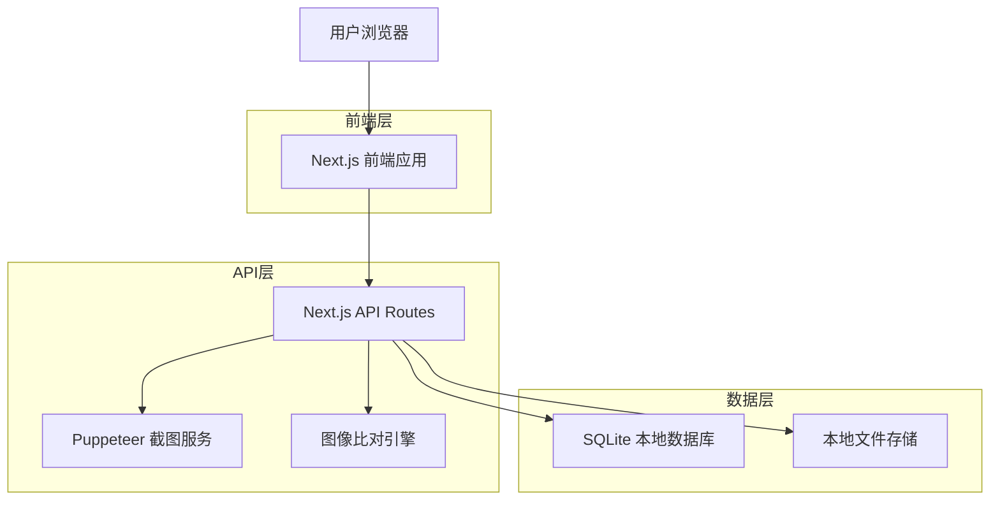
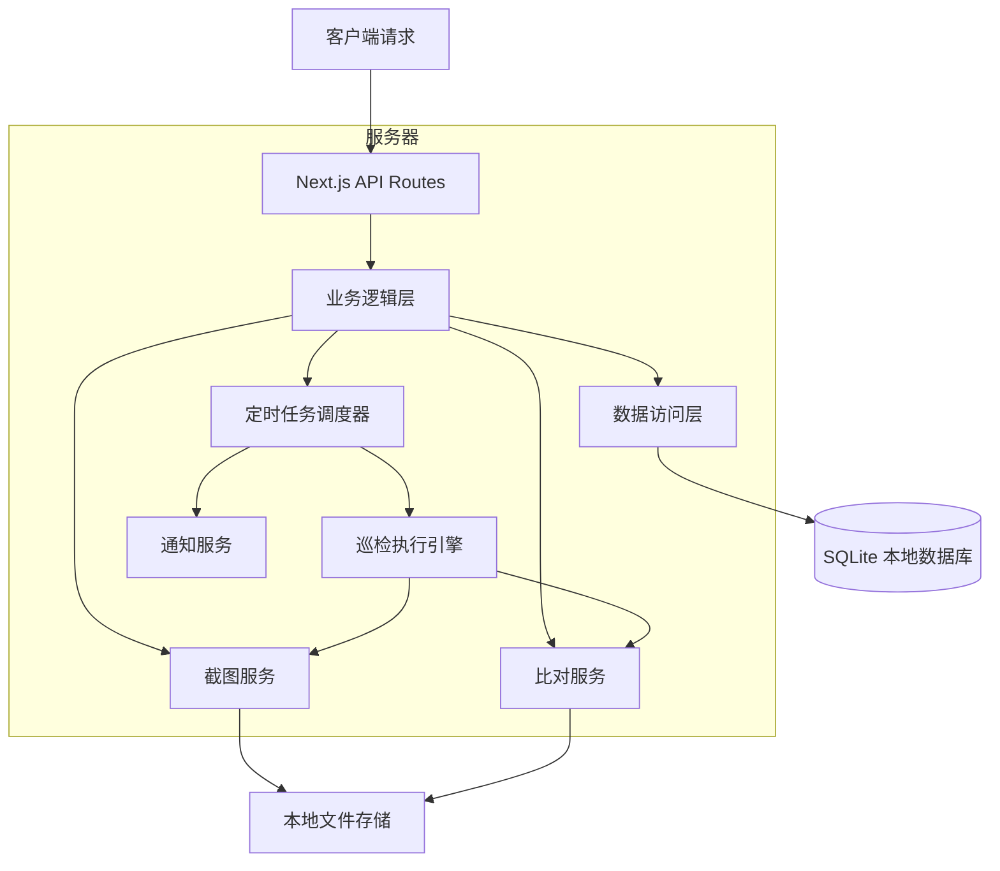
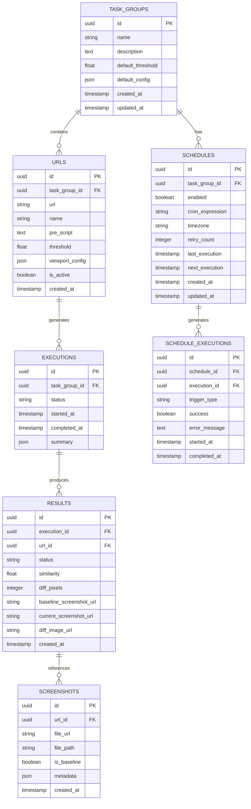

# 快照比对平台技术架构文档

## 1. 架构设计



## 2. 技术描述

- 前端：Next.js@14 + React@18 + TypeScript + Tailwind CSS + Headless UI
- 后端：Next.js API Routes + Puppeteer + Sharp + Pixelmatch + node-cron
- 数据库：SQLite + Prisma ORM 或 better-sqlite3
- 定时任务：node-cron + 后台任务队列
- 通知服务：nodemailer (可选)
- 文件存储：本地文件系统
- 部署：自托管或Docker容器

## 3. 路由定义

| 路由 | 用途 |
|------|------|
| / | 首页，显示平台介绍和快速开始 |
| /task-groups | 任务组列表页面，管理所有任务组 |
| /task-groups/[id] | 任务组详情页面，显示URL列表和执行历史 |
| /task-groups/[id]/results/[resultId] | 比对结果详情页面 |
| /monitoring | 巡检监控页面，显示所有巡检状态和统计 |
| /settings | 设置页面，全局配置和参数设置 |

## 4. API定义

### 4.1 核心API

任务组管理相关
```
GET /api/task-groups
```

Response:
| 参数名称 | 参数类型 | 描述 |
|----------|----------|------|
| id | string | 任务组ID |
| name | string | 任务组名称 |
| description | string | 任务组描述 |
| urls | array | URL列表 |
| created_at | string | 创建时间 |

```
POST /api/task-groups
```

Request:
| 参数名称 | 参数类型 | 是否必需 | 描述 |
|----------|----------|----------|------|
| name | string | true | 任务组名称 |
| description | string | false | 任务组描述 |
| default_threshold | number | false | 默认阈值（0-1），默认0.1 |
| urls | array | true | URL配置列表 |

截图比对相关
```
POST /api/screenshots/capture
```

Request:
| 参数名称 | 参数类型 | 是否必需 | 描述 |
|----------|----------|----------|------|
| url | string | true | 目标URL |
| script | string | false | 前置处理脚本 |
| viewport | object | false | 视口配置 |

Response:
| 参数名称 | 参数类型 | 描述 |
|----------|----------|------|
| screenshot_url | string | 截图文件URL |
| timestamp | string | 截图时间 |

```
POST /api/compare
```

Request:
| 参数名称 | 参数类型 | 是否必需 | 描述 |
|----------|----------|----------|------|
| baseline_url | string | true | 基准图URL |
| current_url | string | true | 当前截图URL |
| url_id | string | true | URL配置ID，用于获取阈值 |

Response:
| 参数名称 | 参数类型 | 描述 |
|----------|----------|------|
| similarity | number | 相似度百分比 |
| diff_pixels | number | 差异像素数 |
| passed | boolean | 是否通过测试 |
| threshold_used | number | 实际使用的阈值 |
| threshold_source | string | 阈值来源（url/task_group） |
| diff_image_url | string | 差异图URL |

**阈值优先级逻辑：**
1. 优先使用URL级别的threshold字段
2. 如果URL的threshold为null，则使用所属任务组的default_threshold
3. 系统默认阈值为0.1（10%差异）

定时巡检相关
```
POST /api/task-groups/[id]/schedule
```

Request:
| 参数名称 | 参数类型 | 是否必需 | 描述 |
|----------|----------|----------|------|
| enabled | boolean | true | 是否启用定时巡检 |
| cron_expression | string | true | cron表达式 |
| timezone | string | false | 时区设置 |
| retry_count | number | false | 失败重试次数 |

```
GET /api/schedules
```

Response:
| 参数名称 | 参数类型 | 描述 |
|----------|----------|------|
| schedules | array | 所有巡检配置列表 |
| total_active | number | 活跃巡检数量 |

```
POST /api/schedules/[id]/trigger
```

手动触发巡检执行

批量阈值设置相关
```
PUT /api/task-groups/[id]/batch-threshold
```

Request:
| 参数名称 | 参数类型 | 是否必需 | 描述 |
|----------|----------|----------|------|
| threshold | number | true | 要设置的阈值（0-1） |
| url_ids | array | false | 指定URL ID列表，为空则应用到所有URL |

Response:
| 参数名称 | 参数类型 | 描述 |
|----------|----------|------|
| updated_count | number | 更新的URL数量 |
| success | boolean | 操作是否成功 |

```
GET /api/monitoring/overview
```

Response:
| 参数名称 | 参数类型 | 描述 |
|----------|----------|------|
| total_schedules | number | 总巡检数量 |
| active_schedules | number | 活跃巡检数量 |
| success_rate | number | 成功率 |
| recent_executions | array | 最近执行记录 |

示例
```json
{
  "name": "首页测试",
  "description": "测试首页在不同分辨率下的显示效果",
  "default_threshold": 0.05,
  "schedule": {
    "enabled": true,
    "cron_expression": "0 */6 * * *",
    "timezone": "Asia/Shanghai",
    "retry_count": 3
  },
  "urls": [
    {
      "url": "https://example.com",
      "name": "首页桌面版",
      "threshold": 0.1,
      "script": "await page.setViewport({width: 1920, height: 1080});"
    },
    {
      "url": "https://example.com/about",
      "name": "关于页面",
      "threshold": null,
      "script": "await page.setViewport({width: 1920, height: 1080});"
    }
  ]
}
```

**阈值使用说明：**
- 首页桌面版：使用URL级别的阈值 0.1（10%）
- 关于页面：threshold为null，使用任务组默认阈值 0.05（5%）
```

## 5. 服务器架构图



## 6. 数据模型

### 6.1 数据模型定义



### 6.2 数据定义语言

任务组表 (task_groups)
```sql
-- 创建任务组表
CREATE TABLE task_groups (
    id TEXT PRIMARY KEY DEFAULT (lower(hex(randomblob(16)))),
    name TEXT NOT NULL,
    description TEXT,
    default_threshold REAL DEFAULT 0.1 CHECK (default_threshold >= 0 AND default_threshold <= 1),
    default_config TEXT DEFAULT '{}',
    created_at DATETIME DEFAULT CURRENT_TIMESTAMP,
    updated_at DATETIME DEFAULT CURRENT_TIMESTAMP
);

-- 创建索引
CREATE INDEX idx_task_groups_created_at ON task_groups(created_at DESC);

-- 创建触发器自动更新 updated_at
CREATE TRIGGER update_task_groups_updated_at 
    AFTER UPDATE ON task_groups
    BEGIN
        UPDATE task_groups SET updated_at = CURRENT_TIMESTAMP WHERE id = NEW.id;
    END;
```

URL配置表 (urls)
```sql
-- 创建URL表
CREATE TABLE urls (
    id TEXT PRIMARY KEY DEFAULT (lower(hex(randomblob(16)))),
    task_group_id TEXT NOT NULL,
    url TEXT NOT NULL,
    name TEXT NOT NULL,
    pre_script TEXT,
    threshold REAL DEFAULT 0.1 CHECK (threshold >= 0 AND threshold <= 1),
    viewport_config TEXT DEFAULT '{"width": 1920, "height": 1080}',
    is_active INTEGER DEFAULT 1,
    created_at DATETIME DEFAULT CURRENT_TIMESTAMP,
    FOREIGN KEY (task_group_id) REFERENCES task_groups(id) ON DELETE CASCADE
);

-- 创建索引
CREATE INDEX idx_urls_task_group_id ON urls(task_group_id);
CREATE INDEX idx_urls_is_active ON urls(is_active);
```

执行记录表 (executions)
```sql
-- 创建执行记录表
CREATE TABLE executions (
    id TEXT PRIMARY KEY DEFAULT (lower(hex(randomblob(16)))),
    task_group_id TEXT NOT NULL,
    status TEXT DEFAULT 'pending' CHECK (status IN ('pending', 'running', 'completed', 'failed')),
    started_at DATETIME DEFAULT CURRENT_TIMESTAMP,
    completed_at DATETIME,
    summary TEXT DEFAULT '{}',
    FOREIGN KEY (task_group_id) REFERENCES task_groups(id) ON DELETE CASCADE
);

-- 创建索引
CREATE INDEX idx_executions_task_group_id ON executions(task_group_id);
CREATE INDEX idx_executions_status ON executions(status);
CREATE INDEX idx_executions_started_at ON executions(started_at DESC);
```

比对结果表 (results)
```sql
-- 创建结果表
CREATE TABLE results (
    id TEXT PRIMARY KEY DEFAULT (lower(hex(randomblob(16)))),
    execution_id TEXT NOT NULL,
    url_id TEXT NOT NULL,
    status TEXT DEFAULT 'pending' CHECK (status IN ('pending', 'passed', 'failed', 'error')),
    similarity REAL,
    diff_pixels INTEGER,
    baseline_screenshot_url TEXT,
    current_screenshot_url TEXT,
    diff_image_url TEXT,
    created_at DATETIME DEFAULT CURRENT_TIMESTAMP,
    FOREIGN KEY (execution_id) REFERENCES executions(id) ON DELETE CASCADE,
    FOREIGN KEY (url_id) REFERENCES urls(id) ON DELETE CASCADE
);

-- 创建索引
CREATE INDEX idx_results_execution_id ON results(execution_id);
CREATE INDEX idx_results_url_id ON results(url_id);
CREATE INDEX idx_results_status ON results(status);
CREATE INDEX idx_results_created_at ON results(created_at DESC);
```

截图文件表 (screenshots)
```sql
-- 创建截图表
CREATE TABLE screenshots (
    id TEXT PRIMARY KEY DEFAULT (lower(hex(randomblob(16)))),
    url_id TEXT NOT NULL,
    file_url TEXT NOT NULL,
    file_path TEXT NOT NULL,
    is_baseline INTEGER DEFAULT 0,
    metadata TEXT DEFAULT '{}',
    created_at DATETIME DEFAULT CURRENT_TIMESTAMP,
    FOREIGN KEY (url_id) REFERENCES urls(id) ON DELETE CASCADE
);

-- 创建索引
CREATE INDEX idx_screenshots_url_id ON screenshots(url_id);
CREATE INDEX idx_screenshots_is_baseline ON screenshots(is_baseline);
CREATE INDEX idx_screenshots_created_at ON screenshots(created_at DESC);
```

定时巡检配置表 (schedules)
```sql
-- 创建定时巡检配置表
CREATE TABLE schedules (
    id TEXT PRIMARY KEY DEFAULT (lower(hex(randomblob(16)))),
    task_group_id TEXT NOT NULL,
    enabled INTEGER DEFAULT 1,
    cron_expression TEXT NOT NULL,
    timezone TEXT DEFAULT 'Asia/Shanghai',
    retry_count INTEGER DEFAULT 3,
    last_execution DATETIME,
    next_execution DATETIME,
    created_at DATETIME DEFAULT CURRENT_TIMESTAMP,
    updated_at DATETIME DEFAULT CURRENT_TIMESTAMP,
    FOREIGN KEY (task_group_id) REFERENCES task_groups(id) ON DELETE CASCADE
);

-- 创建索引
CREATE INDEX idx_schedules_task_group_id ON schedules(task_group_id);
CREATE INDEX idx_schedules_enabled ON schedules(enabled);
CREATE INDEX idx_schedules_next_execution ON schedules(next_execution);

-- 创建触发器自动更新 updated_at
CREATE TRIGGER update_schedules_updated_at 
    AFTER UPDATE ON schedules
    BEGIN
        UPDATE schedules SET updated_at = CURRENT_TIMESTAMP WHERE id = NEW.id;
    END;
```

巡检执行记录表 (schedule_executions)
```sql
-- 创建巡检执行记录表
CREATE TABLE schedule_executions (
    id TEXT PRIMARY KEY DEFAULT (lower(hex(randomblob(16)))),
    schedule_id TEXT NOT NULL,
    execution_id TEXT,
    trigger_type TEXT DEFAULT 'scheduled' CHECK (trigger_type IN ('scheduled', 'manual')),
    success INTEGER DEFAULT 0,
    error_message TEXT,
    started_at DATETIME DEFAULT CURRENT_TIMESTAMP,
    completed_at DATETIME,
    FOREIGN KEY (schedule_id) REFERENCES schedules(id) ON DELETE CASCADE,
    FOREIGN KEY (execution_id) REFERENCES executions(id) ON DELETE SET NULL
);

-- 创建索引
CREATE INDEX idx_schedule_executions_schedule_id ON schedule_executions(schedule_id);
CREATE INDEX idx_schedule_executions_success ON schedule_executions(success);
CREATE INDEX idx_schedule_executions_started_at ON schedule_executions(started_at DESC);
```

通知配置表 (notification_settings)
```sql
-- 创建通知配置表
CREATE TABLE notification_settings (
    id TEXT PRIMARY KEY DEFAULT (lower(hex(randomblob(16)))),
    enabled INTEGER DEFAULT 0,
    email_host TEXT,
    email_port INTEGER DEFAULT 587,
    email_user TEXT,
    email_password TEXT,
    email_from TEXT,
    email_to TEXT,
    notify_on_failure INTEGER DEFAULT 1,
    notify_on_success INTEGER DEFAULT 0,
    created_at DATETIME DEFAULT CURRENT_TIMESTAMP,
    updated_at DATETIME DEFAULT CURRENT_TIMESTAMP
);

-- 创建触发器自动更新 updated_at
CREATE TRIGGER update_notification_settings_updated_at 
    AFTER UPDATE ON notification_settings
    BEGIN
        UPDATE notification_settings SET updated_at = CURRENT_TIMESTAMP WHERE id = NEW.id;
    END;

-- 初始化数据
INSERT INTO task_groups (name, description) VALUES 
('示例任务组', '这是一个演示用的任务组，展示平台的基本功能');

-- 插入默认通知配置
INSERT INTO notification_settings (enabled) VALUES (0);
```

### 6.3 数据库初始化和配置

#### 使用 Prisma ORM (推荐)

安装依赖：
```bash
npm install prisma @prisma/client
npm install -D prisma
```

Prisma Schema 配置 (prisma/schema.prisma)：
```prisma
generator client {
  provider = "prisma-client-js"
}

datasource db {
  provider = "sqlite"
  url      = "file:./dev.db"
}

model TaskGroup {
  id               String   @id @default(cuid())
  name             String
  description      String?
  defaultThreshold Float    @default(0.1) @map("default_threshold")
  defaultConfig    String   @default("{}") @map("default_config")
  createdAt        DateTime @default(now()) @map("created_at")
  updatedAt        DateTime @updatedAt @map("updated_at")
  
  urls        Url[]
  executions  Execution[]
  schedules   Schedule[]
  
  @@map("task_groups")
}

model Url {
  id             String  @id @default(cuid())
  taskGroupId    String  @map("task_group_id")
  url            String
  name           String
  preScript      String? @map("pre_script")
  threshold      Float   @default(0.1)
  viewportConfig String  @default("{\"width\": 1920, \"height\": 1080}") @map("viewport_config")
  isActive       Boolean @default(true) @map("is_active")
  createdAt      DateTime @default(now()) @map("created_at")
  
  taskGroup    TaskGroup     @relation(fields: [taskGroupId], references: [id], onDelete: Cascade)
  results      Result[]
  screenshots  Screenshot[]
  
  @@map("urls")
}

model Schedule {
  id             String    @id @default(cuid())
  taskGroupId    String    @map("task_group_id")
  enabled        Boolean   @default(true)
  cronExpression String    @map("cron_expression")
  timezone       String    @default("Asia/Shanghai")
  retryCount     Int       @default(3) @map("retry_count")
  lastExecution  DateTime? @map("last_execution")
  nextExecution  DateTime? @map("next_execution")
  createdAt      DateTime  @default(now()) @map("created_at")
  updatedAt      DateTime  @updatedAt @map("updated_at")
  
  taskGroup          TaskGroup           @relation(fields: [taskGroupId], references: [id], onDelete: Cascade)
  scheduleExecutions ScheduleExecution[]
  
  @@map("schedules")
}

model ScheduleExecution {
  id          String    @id @default(cuid())
  scheduleId  String    @map("schedule_id")
  executionId String?   @map("execution_id")
  triggerType String    @default("scheduled") @map("trigger_type")
  success     Boolean   @default(false)
  errorMessage String?  @map("error_message")
  startedAt   DateTime  @default(now()) @map("started_at")
  completedAt DateTime? @map("completed_at")
  
  schedule  Schedule   @relation(fields: [scheduleId], references: [id], onDelete: Cascade)
  execution Execution? @relation(fields: [executionId], references: [id], onDelete: SetNull)
  
  @@map("schedule_executions")
}

model NotificationSettings {
  id              String   @id @default(cuid())
  enabled         Boolean  @default(false)
  emailHost       String?  @map("email_host")
  emailPort       Int      @default(587) @map("email_port")
  emailUser       String?  @map("email_user")
  emailPassword   String?  @map("email_password")
  emailFrom       String?  @map("email_from")
  emailTo         String?  @map("email_to")
  notifyOnFailure Boolean  @default(true) @map("notify_on_failure")
  notifyOnSuccess Boolean  @default(false) @map("notify_on_success")
  createdAt       DateTime @default(now()) @map("created_at")
  updatedAt       DateTime @updatedAt @map("updated_at")
  
  @@map("notification_settings")
}
```

#### 使用 better-sqlite3 (轻量级选择)

安装依赖：
```bash
npm install better-sqlite3
npm install -D @types/better-sqlite3
```

数据库连接示例：
```typescript
import Database from 'better-sqlite3';
import path from 'path';

const dbPath = path.join(process.cwd(), 'data', 'snapshot.db');
const db = new Database(dbPath);

// 启用外键约束
db.pragma('foreign_keys = ON');

export default db;
```

## 7. 定时巡检技术实现

### 7.1 定时任务调度

使用 node-cron 实现定时任务调度：

```typescript
import cron from 'node-cron';
import { PrismaClient } from '@prisma/client';

const prisma = new PrismaClient();

class ScheduleManager {
  private tasks: Map<string, cron.ScheduledTask> = new Map();

  async initializeSchedules() {
    const schedules = await prisma.schedule.findMany({
      where: { enabled: true },
      include: { taskGroup: true }
    });

    for (const schedule of schedules) {
      this.createCronTask(schedule);
    }
  }

  createCronTask(schedule: any) {
    const task = cron.schedule(
      schedule.cronExpression,
      async () => {
        await this.executeScheduledTask(schedule.id);
      },
      {
        scheduled: false,
        timezone: schedule.timezone
      }
    );

    this.tasks.set(schedule.id, task);
    task.start();
  }

  async executeScheduledTask(scheduleId: string) {
    try {
      // 创建巡检执行记录
      const scheduleExecution = await prisma.scheduleExecution.create({
        data: {
          scheduleId,
          triggerType: 'scheduled',
          startedAt: new Date()
        }
      });

      // 执行任务组测试
      const execution = await this.runTaskGroupTest(scheduleId);
      
      // 更新执行记录
      await prisma.scheduleExecution.update({
        where: { id: scheduleExecution.id },
        data: {
          executionId: execution.id,
          success: execution.status === 'completed',
          completedAt: new Date()
        }
      });

      // 发送通知（如果配置了）
      await this.sendNotificationIfNeeded(execution);

    } catch (error) {
      console.error('Scheduled task execution failed:', error);
    }
  }
}
```

### 7.2 通知服务实现

```typescript
import nodemailer from 'nodemailer';

class NotificationService {
  private transporter: nodemailer.Transporter | null = null;

  async initialize() {
    const settings = await prisma.notificationSettings.findFirst();
    
    if (settings?.enabled && settings.emailHost) {
      this.transporter = nodemailer.createTransporter({
        host: settings.emailHost,
        port: settings.emailPort,
        secure: settings.emailPort === 465,
        auth: {
          user: settings.emailUser,
          pass: settings.emailPassword
        }
      });
    }
  }

  async sendFailureNotification(execution: any) {
    if (!this.transporter) return;

    const failedResults = execution.results.filter(r => r.status === 'failed');
    
    const mailOptions = {
      from: settings.emailFrom,
      to: settings.emailTo,
      subject: `快照比对失败通知 - ${execution.taskGroup.name}`,
      html: `
        <h2>快照比对测试失败</h2>
        <p><strong>任务组：</strong>${execution.taskGroup.name}</p>
        <p><strong>执行时间：</strong>${execution.startedAt}</p>
        <p><strong>失败数量：</strong>${failedResults.length}</p>
        <h3>失败详情：</h3>
        <ul>
          ${failedResults.map(r => `<li>${r.url.name}: ${r.url.url}</li>`).join('')}
        </ul>
      `
    };

    await this.transporter.sendMail(mailOptions);
  }
}
```

### 7.3 巡检状态监控

```typescript
// API路由：/api/monitoring/overview
export async function GET() {
  const totalSchedules = await prisma.schedule.count();
  const activeSchedules = await prisma.schedule.count({
    where: { enabled: true }
  });

  const recentExecutions = await prisma.scheduleExecution.findMany({
    take: 10,
    orderBy: { startedAt: 'desc' },
    include: {
      schedule: {
        include: { taskGroup: true }
      }
    }
  });

  const successCount = await prisma.scheduleExecution.count({
    where: {
      success: true,
      startedAt: {
        gte: new Date(Date.now() - 24 * 60 * 60 * 1000) // 最近24小时
      }
    }
  });

  const totalCount = await prisma.scheduleExecution.count({
    where: {
      startedAt: {
        gte: new Date(Date.now() - 24 * 60 * 60 * 1000)
      }
    }
  });

  const successRate = totalCount > 0 ? (successCount / totalCount) * 100 : 0;

  return Response.json({
    totalSchedules,
    activeSchedules,
    successRate,
    recentExecutions
  });
}
```

### 7.4 部署注意事项

1. **持久化运行**：确保 Node.js 进程持续运行以维持定时任务
2. **进程管理**：使用 PM2 或 Docker 确保服务稳定性
3. **时区处理**：正确配置服务器时区和数据库时区
4. **错误恢复**：实现任务失败重试和异常恢复机制
5. **资源监控**：监控内存和CPU使用情况，避免资源泄漏

```bash
# 使用 PM2 部署
npm install -g pm2
pm2 start npm --name "snapshot-platform" -- start
pm2 startup
pm2 save
```